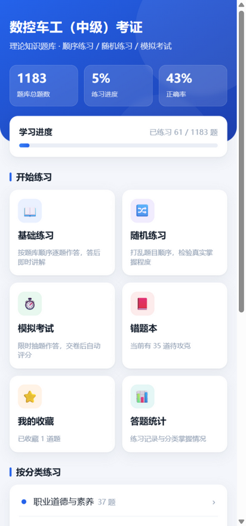
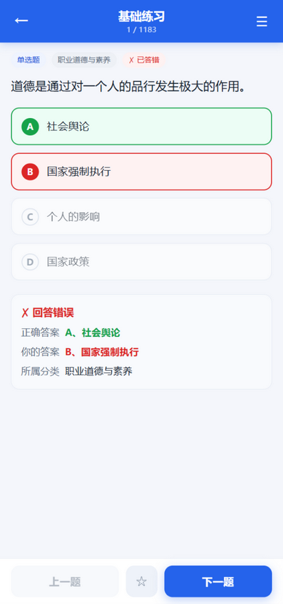
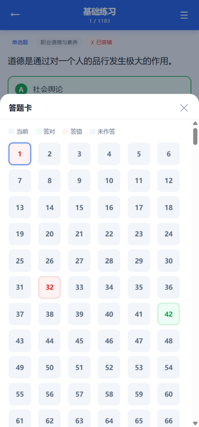
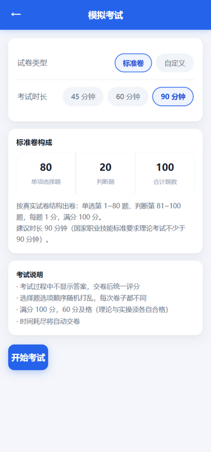
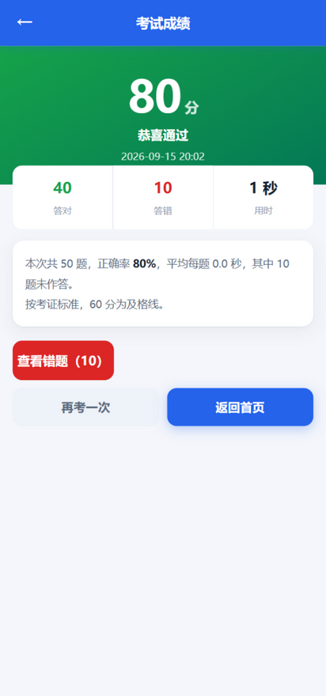
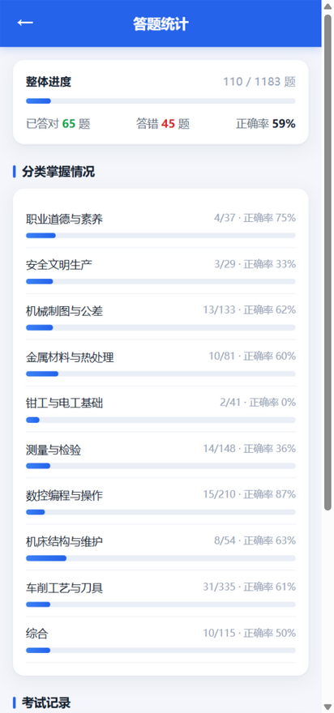

# 数控车工刷题

一个离线 Android 刷题应用，面向**数控车工（中级）考证**理论考试。
实现了类似「在线100分」的**基础练习**与**模拟考试**，支持**屏幕左右滑动切题**与按钮切题双模式，另含错题本、收藏、分类练习和答题统计。

题库 **1200 题**（单选 800 + 判断 400），全量导入源文档题目（保留全部重复题与错题），全部内置在安装包里，**不联网、不申请任何权限**。

| 首页 | 练习解析 | 答题卡 |
|---|---|---|
|  |  |  |

| 考试设置 | 考试中 | 成绩单 | 答题统计 |
|---|---|---|---|
|  |  |  |  |

## 下载安装

到 [**Releases**](../../releases/latest) 页下载 `数控车工刷题-v1.2.apk`，传到手机点击安装，
按提示允许「安装未知来源应用」即可。支持 Android 5.0（API 21）及以上。

## 功能

**基础练习** — 按题库顺序或随机顺序逐题作答，答后立即显示对错、正确答案、你的答案和所属分类。
支持**左右滑屏切题**、上一题 / 下一题按钮、答题卡跳题、收藏标记。已作答的题目会记住结果，重复进入不会重置。

**模拟考试** — 两种出卷方式：

- **标准卷**（推荐）：严格按真实中级理论试卷结构出卷 ——
  **单项选择题 80 题 + 判断题 20 题，共 100 题，每题 1 分，满分 100 分**，建议时长 90 分钟。
  单选与判断按考试顺序分段排列，交卷后按 60 分及格线评分。
- **自定义卷**：自选题量（30 / 50 / 100）、时长（45 / 60 / 90 分钟）和范围（全部 / 仅选择 / 仅判断），
  适合日常练手。

两种方式都随机抽题并**打乱选项顺序**，考试过程中不显示任何答案。同样支持**屏幕左右滑动快速切题**。
倒计时归零自动交卷；交卷前提示未作答数量，交卷后显示对 / 错题数、用时、正确率，
并可一键回看本次错题。考试记录保留最近 30 次，并标注是标准卷还是自定义卷。

> **评分依据**：《车工国家职业技能标准（2018 年版）》规定，理论知识考试与技能操作考核
> 均实行百分制，**成绩皆达 60 分（含）以上为合格**——两科须各自合格，不存在加权合并。
> 理论考试时间不少于 90 分钟。详见 [考试规则说明](docs/考试规则.md)。

**错题本 / 收藏 / 统计** — 答错的题自动进错题本；统计页显示整体进度、各分类掌握度与历次考试成绩。

所有记录存在本机（WebView localStorage），卸载应用即清除，不会上传到任何地方。

## 题库

题目从桌面《数控车工中级考证理论题》Word 文档全量解析而来，**保留全部重复题与错题**。

### 分类

按题干关键词自动归为 10 类（`tools/build_bank.py` 中的 `RULES`），便于分块攻克：

| 分类 | 题量 | 分类 | 题量 |
|---|---:|---|---:|
| 车削工艺与刀具 | 336 | 机床结构与维护 | 55 |
| 数控编程与操作 | 211 | 钳工与电工基础 | 41 |
| 测量与检验 | 152 | 职业道德与素养 | 39 |
| 机械制图与公差 | 133 | 安全文明生产 | 31 |
| 综合 | 121 | 金属材料与热处理 | 81 |

### 全量导入说明

- **1200 道标准题**：800 道带 ABCD 选项的单选题 + 400 道判断题；
- **保留全部重复题**：包含文档中全部 12 道重复题目，不作去重，每道题均独立编号；
- **保留并修复错题**：原文档中选项含特殊单位或漏标括号答案的题目（如防护用品题、切削速度控制题、气源压力单位题等）全部保留并补充标准答案，保证刷题可用。
- **文档后半段 399 条**：后半段为无 ABCD 选项的残缺副本，题干与前半段单选题完全重复，题库规范收录全部 1200 道单选与判断正题。

最终 **1200 题** = 800 单选 + 400 判断。

## 自行构建

### 环境

```
JDK 11 · Gradle 7.5（用仓库自带 wrapper）· Android SDK（compileSdk 32 / build-tools 33.0.2）
```

### 构建 APK

```bash
cd android
# 指向你自己的 Android SDK
echo "sdk.dir=/path/to/android-sdk" > local.properties
./gradlew assembleRelease
# 产物：android/app/build/outputs/apk/release/app-release.apk
```

仓库里的 `quiz.keystore` 是**自签名测试证书**，口令就写在 `app/build.gradle` 里（不是机密）。
保留它是为了让 Release 包能覆盖安装（签名一致）。删掉这个文件也能构建，只是不再签名。

### 从 Word 文档重新生成题库

需要先把 `.doc` 转成 `.docx`（Word / WPS 打开后另存为即可），然后：

```bash
# 需要 python-docx
pip install python-docx

python tools/build_bank.py source/qbank.docx data/qbank.json   # 解析文档
python tools/make_assets.py                                     # 同步到 assets/www/qbank.js
```

`source/` 目录不入库（题目内容版权归原出版方，见下）。

## 云端控制与每日密码

应用支持**远程云控每日密码**功能。通过修改 GitHub 仓库根目录下的 [`access_control.json`](access_control.json)，您可以随时决定**今天是否需要输入密码**以及**密码内容**，无需重新打包 APK：

```json
{
  "enabled": false,
  "password": "8888",
  "notice": "今日学习密码请向指导老师获取",
  "updated_at": "2026-09-17"
}
```

### 控制参数说明
- `enabled`: `true` 表示开启密码锁（学生启动应用必须输入密码）；`false` 表示关闭（所有人直接自由进入）。
- `password`: 当日设定的密码字符串（如 `"8888"`、`"skq2026"` 等，支持字母与数字）。
- `notice`: 锁屏界面显示的提示文案（如「今日密码请向指导老师获取」或「9月18日特训班密码」）。
- `updated_at`: 配置更新日期。

### 工作机制
1. **秒级生效**：软件启动时通过国内高速 CDN 异步拉取该配置（超时 2.5 秒兜底，绝不卡死）。
2. **当日免重复输入**：同一台手机当天验证成功后，当天内多次打开无需重复输入。
3. **支持离线与容错**：无网络或断网环境下，已验证用户正常刷题，默认不阻拦学员学习。

## 项目结构

```
android/                         Android 工程
├── app/src/main/
│   ├── java/com/quiz/shukong/MainActivity.java   # 单 WebView 壳
│   └── assets/www/                               # 刷题应用本体
│       ├── index.html           # 页面骨架（含每日密码锁屏）
│       ├── style.css            # 样式（含非线性物理弹性动画）
│       ├── app.js               # 业务逻辑（含手势切题、云控鉴权）
│       ├── access_control.json  # 本地兜底访问控制配置
│       └── qbank.js             # 题库（内联为 JS 变量，1200 题）
└── build.gradle / settings.gradle

access_control.json              根目录云端配置文件（直接在 GitHub 网页编辑即可生效）
data/qbank.json                  结构化题库（1200 题，含分类）
tools/build_bank.py              Word docx → 1200题全量 JSON 解析脚本
tools/make_assets.py             JSON → qbank.js 同步脚本
docs/screenshots/                README 截图
```

### 几个实现要点

- 页面通过 `WebViewAssetLoader` 以 `https://appassets.androidplatform.net/` 提供，而非 `file://`，支持 localStorage 持久化且无需申请敏感权限。
- 手势引擎采用双向非线性阻尼判定（支持移动端单指滑动与 PC 鼠标拖拽），完美兼顾纵向滚动与横向切题。
- 全站动画采用物理非线性贝塞尔曲线（`cubic-bezier(0.16, 1, 0.3, 1)` 与弹性 `cubic-bezier(0.34, 1.35, 0.64, 1)`），交互丝滑自然。
- 题库 1200 题（800 单选 + 400 判断）全量保留重复题与错题，无一遗漏。

## 已验证 / 测试

- **Playwright 端到端自动化测试**：覆盖每日密码鉴权（正确/错误/回车/显隐切换/当日免密）、1200 题库加载、左右滑屏手势、模拟考试与错题本，100% 通过；
- **Release APK 编译与签名**：成功打包输出 `数控车工刷题-v1.1.apk`（约 2.36 MB），已同步至桌面。

**未验证**

- 未在真机或模拟器上运行。截图来自浏览器渲染（视口 412×880），
  建议装到手机上跑一遍，重点看低版本 WebView 的样式表现。

## 许可

代码采用 [MIT License](LICENSE)。

`data/qbank.json` 中的题目内容来自《数控车工中级考证理论题》文档，
著作权归原出版方 / 原始出题机构所有，**不在 MIT 授权范围内**。
本项目仅作个人学习工具，如需商用或再分发题目内容，请自行确认授权情况。
